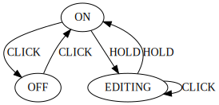

# ESPHome State Machine
A flexible [Finite-State Machine](https://en.wikipedia.org/wiki/Finite-state_machine) implemented on top of a `text_sensor`. It lets you model complex behaviours with limited inputs, such as:

* Controlling dimmable `light` with a single button.
* Controlling a garage door `cover` with a single button.
* Controlling a `display` a button (e.g. flip through pages on click, and go into editing mode on hold).
* And more...

## Installing

```yaml
external_components:
  - source:
      type: git
      url: https://github.com/muxa/esphome-state-machine
      ref: dev
```

## Configuration

The basic state machine configuration involves providing:

* A list of `states`
* A list of `inputs`
* A list of allowed `transitions` for each input.

Example for a simple on/off toggle state machine:


```yaml
text_sensor:
  - platform: state_machine
    name: On/Off Toggle State Machine
    initial_state: "OFF"
    states:
      - "OFF"
      - "ON"
    inputs:
      - name: TOGGLE
        transitions:
          - ON -> OFF
          - OFF -> ON
```

And to transition between states it you'll need to trigger the machine by providing input, e.g:

```yaml
binary_sensor:
  - platform: gpio
    pin: D6
    name: "Button"
    filters:
      - delayed_on: 100ms
    on_press:
      - state_machine.transition: TOGGLE
```

## Configuration variables:

* **initial_state** (**Required**, string): The intial state of the state machine.
* **states** (**Required**, list): The list of states that the state machine has.

  * **name** (**Required**, string): The name of the state. Must not repeat.
  * **on_enter** (*Optional*, [Automation](https://esphome.io/guides/automations.html#automation)): An automation to perform when entering this state. 
  * **on_leave** (*Optional*, [Automation](https://esphome.io/guides/automations.html#automation)): An automation to perform when leaving this state. 

* **inputs** (**Required**, list): The list of inputs that the state machine supports with allowed state transitions.

  * **name** (**Required**, string): The name of the input. Must not repeat.
  * **transitions** (**Required**, list): The list of allowed transitions. Short form is `FROM_STATE -> TO_STATE`, or advanced configuration:
    * **from** (**Required**, string): Source state that this input is allowed on.
    * **to** (**Required**, string): Target state that this input transitions to.
    * **action** (*Optional*, [Automation](https://esphome.io/guides/automations.html#automation)): An automation to perform when transition is performed. 
  * **action** (*Optional*, [Automation](https://esphome.io/guides/automations.html#automation)): An automation to perform when transition is done by this input. This action is performed after transition-specific action. 

> ### Note:
>
> Any running state machine automations (state, input and transition) will be stopped before running next automations. This is useful when there's a delayed transition in one of the automation and it needs to be cancelled because a new input was provided which results in a different transition. 

## `state_machine.transition` Action

You can provide input to the state machine from elsewhere in your WAML file with the `state_machine.transition` action.
```yaml
# in some trigger
on_...:
  # Basic:
  - state_machine.transition: TOGGLE

  # Advanced (if you have multiple state machines in one YAML)
  - state_machine.transition:
      id: sm1
      input: TOGGLE
```

Configuration options:

* **id** (*Optional*, [ID](https://esphome.io/guides/configuration-types.html#config-id)): The ID of the state machine.
* **input** (**Required**, string): The input to provide in order to transition to the next state.

## `state_machine.transition` Condition

This condition lets you check what transition last occurred.

```yaml
# in some trigger
on_...:
  # Basic
  if:
    condition:
      state_machine.transition:
        trigger: TOGGLE
    then:
      - logger.log: Toggled

  # Advanced
  if:
    condition:
      state_machine.transition:
        id: sm1
        from: "OFF"
        trigger: TOGGLE
        to: "ON"
    then:
      - logger.log: Turned on by toggle
```

## Diagrams

When compiling or validating your YAML a state machine diagram will be generated using [DOT notation](https://en.wikipedia.org/wiki/DOT_(graph_description_language)), with a link to view the diagram, e.g:

```
INFO State Machine Diagram (for On/Off Toggle State Machine): https://quickchart.io/graphviz?graph=digraph%20%22On/Off%20Toggle%20State%20Machine%22%20%7B%0A%20%20node%20%5Bshape%3Dellipse%5D%3B%0A%20%20ON%20-%3E%20OFF%20%5Blabel%3DTOGGLE%5D%3B%0A%20%20OFF%20-%3E%20ON%20%5Blabel%3DTOGGLE%5D%3B%0A%7D

digraph "On/Off Toggle State Machine" {
  node [shape=ellipse];
  ON -> OFF [label=TOGGLE];
  OFF -> ON [label=TOGGLE];
}
```

## All Examples

### Simple Toggle


This example illustrates toggling an LED using a button.

See [toggle_example.yaml](toggle_example.yaml).

### Button Controlled Dimmable Light



This example models a single button control for a dimmable light with the following functionality:
* CLICK to toggle ON of OFF
* HOLD to go into EDITING mode to adjust brightness with a CLICK.

See [dimmable_light_example.yaml](dimmable_light_example.yaml).

